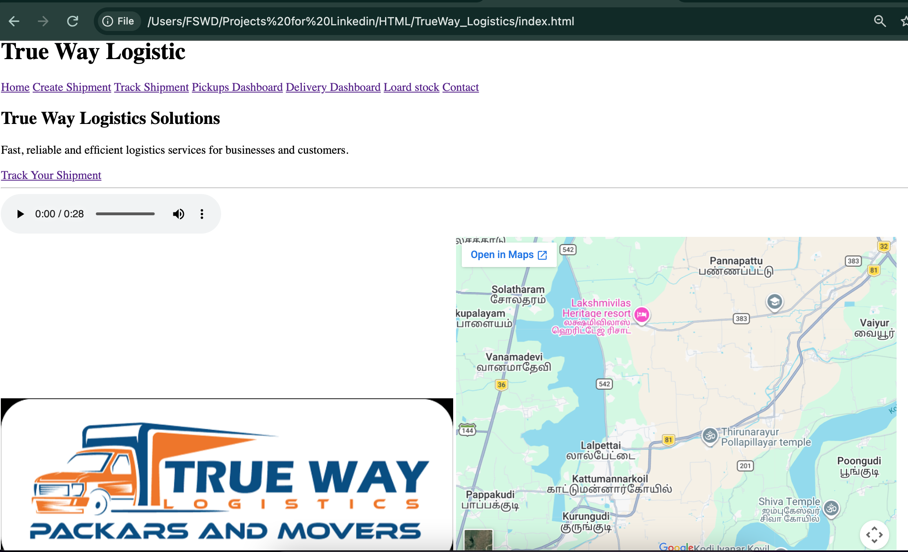
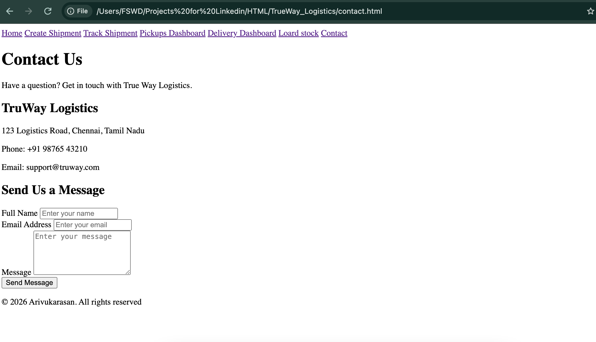
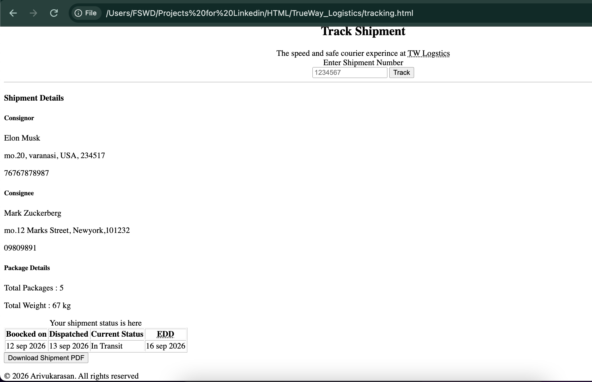

# True Way Logistics

A beginner-level multi-page logistics website created using HTML to practice forms, tables, links, and webpage navigation.

## 📌 About the Project

True Way Logistics is a beginner HTML project based on the logistics industry.

I created this project to practice building a larger website using HTML and to understand how different webpages can be connected together.

The project focuses on using HTML forms, tables, links, and multiple pages to create a basic logistics-related website.

## ✨ Features

* Multi-page website
* Logistics-based content
* HTML forms
* HTML tables
* Internal and external links
* Navigation between webpages
* Headings and paragraphs
* Lists
* Images
* Basic webpage structure

## 📸 Screenshots

### Home Page

### Contact Page

### Tracking Page

## 🛠️ Technologies Used

* HTML5

## 🎯 Purpose of the Project

The main purpose of this project is to practice:

* Creating forms
* Creating tables
* Using hyperlinks
* Connecting multiple HTML pages
* Organizing website content
* Understanding webpage navigation
* Building a beginner-level industry-based website

## 🚀 How to Run

1. Download or clone this repository.
2. Open the project folder.
3. Open the main HTML file in a web browser.
4. Navigate through the different pages using the links.

No additional installation is required.

## 🔗 GitHub Repository

[True Way Logistics](https://github.com/arivudurga835/HTML_TrueWay_Logistics.git)

## 👨‍💻 Author

**Arivukkarasan J**

This project was created as part of my HTML and Web Development learning journey.
